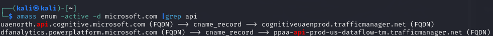

# APISec

# Active API Reconnaissance

## Using nmap Tool
```
# First Command
nmap -sC -sV 127.0.0.1 #

# 
nmap -p- 127.0.0.1 #

#
nmap -sV 127.0.0.1 -p 8025
```

## Using amass Tool

````
#
amass enum list #

#
amass enun -active -d crapi.apisec.ai #

# example of output, usin Microsoft.com

amass enun -active -d microsoft.com #
````
### Output expected


## Using gobuster
```
sudo apt-get install gobuster -y  # Install GoBuster

gobuster dir -u http://127.0.0.1:8888 -w /path/to/wordlist/file.txt -b 200
````
